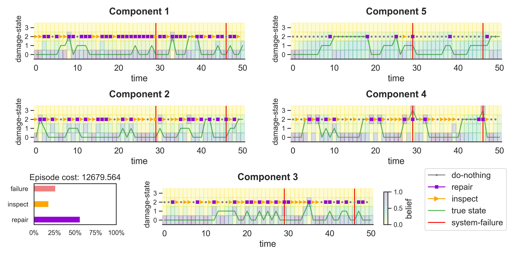

# Inspection and Maintenance Planning using Reinforcement Learning (IMPRL)

A library for applying reinforcement learning to inspection and maintenance planning of deteriorating engineering systems. This library was primarily developed as a pedogogic excercise and for research use.

Example rollout of a DDQN agent in a 5-out-of-5 system:



## Installation

### 1. Create a virtual environment

```bash
conda create --name imprl_env -y python==3.9
conda activate imprl_env
```

### 2. Install the dependencies

```bash
pip install poetry==1.8 # or conda install -c conda-forge poetry==1.8
poetry install
```

Following best practices, `poetry install` installs the dependencies from the `poetry.lock` file. This file rigorously specifies all the dependencies required to build the library. It ensures that the project does not break because of unexpected changes in (transitive) dependencies ([more info](https://python-poetry.org/docs/basic-usage/#installing-with-poetrylock)).

<details>
<summary>Installing additional packages</summary>

You can them add via `poetry add` ([official docs](https://python-poetry.org/docs/cli/#add)) in the command line. 

For example, to install [Jupyter notebook](https://pypi.org/project/notebook/),

```bash 
# Allow >=7.1.2, <8.0.0 versions
poetry add notebook@^7.1.2
```
This will resolve the package dependencies (and adjust versions of transitive dependencies if necessary) and install the package. If the package dependency cannot be resolved, try to relax the package version and try again.
</details>

### 3. Setup wandb

For logging, the library relies on [wandb](https://wandb.ai). You can log into wandb using your private API key, 

```bash
wandb login
# <enter wandb API key>
```

## RL Agents

The following (multi-agent) reinforcement algorithms are implemented,
  - Double Deep Q-Network (DDQN)
  - Joint Actor Critic (JAC)
  - [Deep Centralized Multi-agent Actor Critic (DCMAC)](https://www.sciencedirect.com/science/article/abs/pii/S0951832018313309)
  - [Deep Decentralized Multi-agent Actor Critic (DDMAC)](https://www.sciencedirect.com/science/article/abs/pii/S095183202100106X)
    - current implementation does not support constraints in the objective function
  - Independent Actor Centralized Critic (IACC)
    - also referred to as [DDMAC-CTDE](https://arxiv.org/abs/2401.12455) in literature
  - Independent Actor Centralized Critic with Paramater Sharing (IACC-PS)
  - Independent Actor Critic (IAC)
  - Independent Actor Critic with Paramater Sharing (IAC-PS)

The base actor-critic algorithm: ACER from [SAMPLE EFFICIENT ACTOR-CRITIC WITH EXPERIENCE REPLAY](https://arxiv.org/pdf/1611.01224.pdf) by Wang et al., an off-policy algorithm that uses weighted sampling for experience replay.

### Classification of algorithms

<div class="tg-wrap"><table class="tg">
<tbody>
  <tr>
    <td class="tg-8bgf">Paradigm</td>
    <td class="tg-8bgf">Mathematical<br>Framework</td>
    <td class="tg-8bgf">Algorithm</td>
    <td class="tg-8bgf">Observation</td>
    <td class="tg-8bgf">Action</td>
    <td class="tg-8bgf">Critic</td>
    <td class="tg-8bgf">Actor <br></td>
  </tr>
  <tr>
    <td class="tg-9wq8" rowspan="3">CTCE</td>
    <td class="tg-9wq8">POMDP</td>
    <td class="tg-g7sd">JAC</td>
    <td class="tg-9wq8" rowspan="3">Joint</td>
    <td class="tg-9wq8">Joint</td>
    <td class="tg-9wq8" rowspan="3">Centralized</td>
    <td class="tg-9wq8">Shared</td>
  </tr>
  <tr>
    <td class="tg-9wq8" rowspan="2"><span style="font-weight:400;font-style:normal">MPOMDP</span></td>
    <td class="tg-g7sd">DCMAC</td>
    <td class="tg-9wq8">Factored</td>
    <td class="tg-9wq8">Shared</td>
  </tr>
  <tr>
    <td class="tg-g7sd">DDMAC</td>
    <td class="tg-9wq8">Factored</td>
    <td class="tg-9wq8">Independent</td>
  </tr>
  <tr>
    <td class="tg-9wq8" rowspan="2">CTDE</td>
    <td class="tg-9wq8" rowspan="4">Dec-POMDP</td>
    <td class="tg-g7sd">IACC (DDMAC-CTDE)</td>
    <td class="tg-9wq8" rowspan="2">Independent</td>
    <td class="tg-9wq8">Independent</td>
    <td class="tg-9wq8" rowspan="2">Centralized</td>
    <td class="tg-9wq8"><span style="font-weight:400;font-style:normal">Independent</span></td>
  </tr>
  <tr>
    <td class="tg-g7sd">IACC-PS (DDMAC-CTDE-PS)</td>
    <td class="tg-9wq8">Independent</td>
    <td class="tg-9wq8">Shared</td>
  </tr>
  <tr>
    <td class="tg-9wq8" rowspan="2">DTDE</td>
    <td class="tg-g7sd">IAC</td>
    <td class="tg-9wq8" rowspan="2"><span style="font-weight:400;font-style:normal">Independent</span></td>
    <td class="tg-9wq8">Independent</td>
    <td class="tg-9wq8" rowspan="2">Decentralized</td>
    <td class="tg-9wq8"><span style="font-weight:400;font-style:normal">Independent</span></td>
  </tr>
  <tr>
    <td class="tg-g7sd">IAC-PS</td>
    <td class="tg-9wq8">Independent</td>
    <td class="tg-9wq8">Shared</td>
  </tr>
</tbody>
</table></div>


## Acknowledgements

This project utilizes the clever abstractions in [EPyMARL](https://github.com/uoe-agents/epymarl) and the author would like to acknowledge the insights shared in [Reinforcement Learning Implementation Tips and Tricks](https://agents-lab.org/blog/reinforcement-learning-implementation-tricks/) for developing this library.


## Related Work

[IMP-MARL](https://github.com/moratodpg/imp_marl): a Suite of Environments for Large-scale Infrastructure Management Planning via MARL
  - Benchmarking scalability of cooperative MARL methods in real-world infrastructure management planning problems.
  - Environments: (Correlated and uncorrelated) k-out-of-n systems and offshore wind structural systems.
  - RL solvers: Provides wrappers for interfacing with several (MA)RL libraries such as [EPyMARL](https://github.com/uoe-agents/epymarl), [Rllib](imp_marl/imp_wrappers/examples/rllib/rllib_example.py), [MARLlib](imp_marl/imp_wrappers/marllib/marllib_wrap_ma_struct.py) etc.

[IMP-act](https://github.com/AI-for-Infrastructure-Management/imp-act): Benchmarking MARL for Infrastructure Management Planning at Scale with JAX
  - Large-scale road networks with up to 178 agents implemented in [JAX](https://jax.readthedocs.io/en/latest/) for scalability.
  - [IMP-act-JaxMARL](https://github.com/AI-for-Infrastructure-Management/imp-act-JaxMARL) interfaces IMP-act with multi-agent solvers in [JaxMARL](https://github.com/FLAIROx/JaxMARL).
  -  We also provide NumPy-based environments for compatibility with PyTorch in [IMP-act-epymarl](https://github.com/AI-for-Infrastructure-Management/imp-act-epymarl).

[Multi-agent deep reinforcement learning with centralized training and decentralized execution for transportation infrastructure management](https://arxiv.org/abs/2401.12455)
- Infrastructure management is modeled as a constrained multi-agent POMDP, capturing uncertainty, limited budgets, and interdependent maintenance decisions.
- It employs deep decentralized multi-agent actor-critic (DDMAC) framework with centralized training and decentralized execution (CTDE) for scalable, coordinated decision-making.
- Performance is demonstrated on a real transportation network with 96 components (11 bridges and 85 highway sections), showing significant improvements over traditional methods.